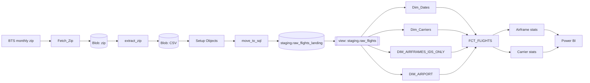
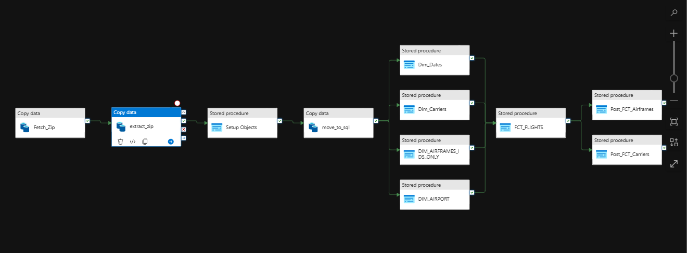

# Azure Infrastructure

This document covers the Azure side of the BTS Flight Delay Warehouse: which services are used, how they're configured, how the pipeline is orchestrated, and the operational lessons learned while building it.

> **Status:** Pipeline fully built. End-to-end proof run (load a month, rerun it, confirm identical row counts) is pending re-enablement of the Azure subscription. See [Status](#status).

---

## Services at a glance

| Service | Role | Configuration |
|---|---|---|
| **Azure Data Factory** | Orchestration: download, extract, load, transform | Factory `monthly-automation`, two pipelines (`Main`, `Nuke`) |
| **Azure Blob Storage** | Landing area for downloaded BTS zips and extracted CSVs | Private container, SAS-token access |
| **Azure SQL Database** | Warehouse: staging, star schema, quarantine | Free offer, serverless, auto-pause, West US 3 |
| **Power BI Desktop** | Reporting layer (not Azure, connects to Azure SQL) | Import mode |

---

## Architecture



## Azure SQL Database

**Tier:** Azure SQL Database free offer: 100,000 vCore-seconds/month, 32 GB storage, serverless with auto-pause enabled.

**Region:** West US 3, chosen over Canada Central/East for lower latency from Vancouver during development.

**Auto-pause behaviour:** The first connection after a pause takes roughly a minute while the database resumes. This shows up as a "hang" in ADF (e.g. when importing stored procedure parameters). Run any query (`SELECT 1;`) to wake it.

### Schemas

| Schema | Purpose |
|---|---|
| `staging` | Raw landing table, typed view, and all load procedures |
| `warehouse` | Star schema: one fact table, five dimensions |
| `quarantine` | Malformed rows stored as JSON for later repair |

### Staging design: landing table + view

BTS CSVs have a trailing comma on every line, producing an unnamed 110th column. ADF's delimited-text source cannot handle an empty header name, so the file is read **headerless** and ADF auto-names columns `Prop_0` … `Prop_N`.

- `staging.raw_flights_landing`: 111 generic `VARCHAR(255)` columns (`Prop_0`–`Prop_110`). ADF name-matches straight into it with no mapping. `Prop_109` absorbs the phantom column; `Prop_110` is a spare.
- `staging.raw_flights`: a view that aliases each `Prop_N` to its real BTS column name by position, and filters out any stray header row as a backstop.

All load procedures read from the view, so the landing-table workaround is invisible to them. Typing happens downstream via `TRY_CAST`.

### Stored procedures

| Object | Stage | Purpose |
|---|---|---|
| `dbo.usp_setup_objects` | Pipeline start | Idempotently creates schemas, tables, constraints, the staging view, and seeds reference carriers |
| `staging.usp_load_dim_date` | Pre-fact (parallel) | Extends `dim_date` to cover every date in staging |
| `staging.usp_load_dim_carrier` | Pre-fact (parallel) | Inserts unseen carriers as inferred members |
| `staging.usp_load_dim_airport` | Pre-fact (parallel) | Inserts new airports from origin **and** destination |
| `staging.usp_load_dim_airframe` | Pre-fact (parallel) | Inserts new tail numbers (keys only) |
| `staging.usp_load_fact_flight` | Fact | Loads one month; skips if already loaded unless forced |
| `staging.usp_update_airframe_stats` | Post-fact (parallel) | Recomputes lifetime per-tail stats from the fact |
| `staging.usp_update_carrier_stats` | Post-fact (parallel) | Recomputes per-carrier airframe counts from the fact |
| `dbo.usp_drop_objects` | Manual only | Guarded drop of one table or the whole warehouse |
| `dbo.ToTime` | Function | Converts BTS `hhmm` strings to `TIME(0)` |

Every load procedure follows the same pattern: `SET NOCOUNT ON`, `SET XACT_ABORT ON`, a transaction, and a `CATCH` block that rolls back and re-raises with `THROW`. Failures stop the pipeline loudly rather than reporting success.

### Custom error codes

| Code | Raised by | Meaning |
|---|---|---|
| 50001 | `usp_load_fact_flight` | Staging has no rows for the requested Year/Month; aborts before touching the warehouse |
| 50002 | `usp_load_dim_date` | No parseable `FlightDate` values in staging |
| 50100 | `usp_drop_objects` | Target is not on the whitelist |
| 50101 | `usp_drop_objects` | Confirmation phrase missing or incorrect |
| 50102 | `usp_drop_objects` | Target is still referenced by a foreign key |

---

## Azure Blob Storage

A private container holds the downloaded BTS zip files and the extracted CSVs. Nothing in the container is publicly accessible.

Azure SQL can read from the container directly via a SAS-token external data source, used during early development for `BULK INSERT` loads:

```sql
CREATE MASTER KEY ENCRYPTION BY PASSWORD = '<STRONG_PASSWORD>';

CREATE DATABASE SCOPED CREDENTIAL BlobSasCredential
WITH IDENTITY = 'SHARED ACCESS SIGNATURE',
     SECRET   = '<SAS_TOKEN>';

CREATE EXTERNAL DATA SOURCE BlobFlights
WITH (TYPE = BLOB_STORAGE,
      LOCATION = 'https://<storage_account>.blob.core.windows.net/<container>',
      CREDENTIAL = BlobSasCredential);
```

Secrets are placeholders. Real values are never committed.

---

## Azure Data Factory



**Factory:** `monthly-automation`

### Pipeline: `Main`

**Parameters**

| Name | Type | Notes |
|---|---|---|
| `Year` | String | e.g. `2002` |
| `Month` | String | e.g. `1` |
| `Force` | Boolean (optional) | Omit for normal runs. `true` reloads a month that already exists |

**Activity order**

```
Fetch_Zip → extract_zip → Setup Objects → move_to_sql
    → [Dim_Dates | Dim_Carriers | DIM_AIRFRAMES_IDS_ONLY | DIM_AIRPORT]
    → FCT_FLIGHTS
    → [Airframe stats | Carrier stats]
```

Bracketed groups run in parallel. ADF dependencies are AND: the fact only runs when all four dimension activities succeed.

**Copy activity (`move_to_sql`) configuration**

| Setting | Value |
|---|---|
| Source header | Off (headerless read) |
| Skip line count | 1 |
| Sink table | `staging.raw_flights_landing` |
| Write behaviour | Insert |
| Pre-copy script | `TRUNCATE TABLE staging.raw_flights_landing` |
| Mapping | Cleared (auto name-match on `Prop_N`) |

The pre-copy truncate is what keeps staging at exactly one month. Without it, every rerun appends another copy, which was the cause of a double-load bug caught during development.

### Pipeline: `Nuke`

A deliberately separate pipeline that calls `dbo.usp_drop_objects` with `@Target = 'ALL'`.

| Parameter | Default | Purpose |
|---|---|---|
| `Confirm` | *(none)* | Must be typed at trigger time: `NUKE <database_name>` |
| `DryRun` | `true` | Lists what would be dropped without dropping anything |

It is never attached to a schedule trigger and never wired into `Main`. An unconnected activity inside `Main` would fire at pipeline start on every run.

---

## Idempotency and safety

- **Staging:** truncate and reload every run.
- **Dimensions:** `INSERT ... WHERE NOT EXISTS`, so reruns insert nothing new.
- **Fact:** skip-if-loaded by default; `Force = true` deletes and reloads exactly one month inside a transaction.
- **Deterministic key:** `FlightKey` is a hash of date, carrier, flight number, origin, and scheduled departure. The same flight always gets the same key, and a duplicate insert fails loudly on the primary key instead of silently doubling counts.
- **Foreign keys:** the fact references `dim_date`, `dim_carrier`, and `dim_airport` (origin and destination). Orphan rows fail at load time rather than appearing as "(Blank)" in Power BI.
- **Destructive operations:** whitelisted targets, environment-specific confirmation phrase, FK-aware ordering, dry-run default for full wipes.

---

## Operational notes

- **Publish after every meaningful change.** Unpublished ADF work can be lost when a session ends.
- **Boolean parameters take `true`/`false` only.** `0`, `1`, and blank all fail with error 2011.
- **Debug runs don't appear in Monitor.** They show in the pipeline canvas's Output tab, where each activity's Input and Output can be inspected.
- **Parameter import lists alphabetically** (`Force`, `Month`, `Year`). Double-check mappings, since it's easy to cross `Year` and `Month`.
- **Setup is the source of truth.** Any manual `ALTER` in SSMS must also be copied into `usp_setup_objects`, or it will be lost on the next rebuild.

---

## Cost and account notes

The Azure free account has two separate clocks: a $200 credit valid for 30 days, and 12 months of free services that only continue after upgrading to pay-as-you-go. Without the upgrade, the entire subscription is disabled when the trial ends, including the Azure SQL free offer.

This project hit that limit mid-build. The fix is to set a budget alert first, then upgrade. Expected ongoing cost for this project is small: ADF charges per activity run and per DIU-hour, and the SQL free offer remains free.

---

## Status

- [x] Setup, dimension, fact, and stats procedures
- [x] Landing table + view staging design
- [x] `Main` and `Nuke` pipelines built
- [ ] Re-enable subscription (budget alert, then upgrade)
- [ ] Clean run: truncate landing, run Jan 2002, confirm ~436k fact rows
- [ ] Rerun same month, confirm fact is skipped and count is unchanged
- [ ] Export ARM template (pipelines, datasets, linked services)
- [ ] Screenshots: resource group, pipeline canvas, green run, row-count proof

---

## Known limitations and next iterations

- **Power BI refresh is manual.** In production, a final ADF Web activity would trigger a dataset refresh via the Power BI REST API.
- **Rerunning a loaded month still re-downloads and re-stages it.** A Lookup + If Condition at pipeline start could skip the whole run.
- **Fact reloads are delete-and-insert.** A `MERGE`-based upsert on `FlightKey` would only rewrite changed rows.
- **Dimension attributes are first-seen.** Changes to airport names etc. aren't tracked (SCD Type 1/2 not implemented).
- **`'2400'` midnight times convert to NULL.** `dbo.ToTime` could map them to `00:00`.
- **Rows with unparseable `FlightDate` are dropped** by the fact's date filter rather than quarantined.
- **`MaxContinuousHops` / `AvgContinuousHops`** in `dim_airframe` are stubbed as NULL.
- **Production hardening:** destructive procedures would be restricted to FIDO2-authenticated admin identities via Microsoft Entra ID rather than an in-database confirmation phrase, since a secret stored inside the database can't meaningfully protect that database.
