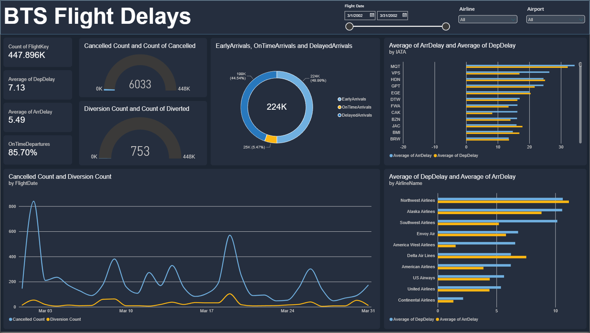
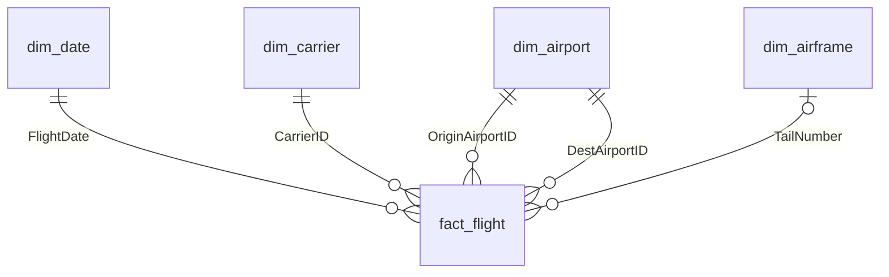

<a href="https://github.com/darshilmistry">< Go to profile</a>



# BTS Flight Delay Data Warehouse

An end-to-end data warehouse built on Azure from the U.S. Bureau of Transportation Statistics (BTS) Airline On-Time Performance data. Monthly flight records are downloaded, staged, and modelled into a star schema by an orchestrated Azure Data Factory pipeline, then surfaced in a Power BI operational performance dashboard.

**Stack:** Azure Data Factory · Azure Blob Storage · Azure SQL Database · T-SQL · Power BI

| Document | Covers |
|---|---|
| **README.md** (this file) | Overview, data model, design decisions |
| [Azure](Azure/AZURE.md) | Azure services, pipeline orchestration, operations |
| [POWERBI](PowerBi/POWERBI.md) | Reporting layer, measures, future work |

> **Status:** Warehouse and pipeline fully built. The end-to-end proof run (load a month, rerun it, confirm identical counts) is pending re-enablement of the Azure subscription.

---

## Why this dataset

BTS On-Time Performance covers every scheduled domestic flight by major U.S. carriers from October 1987 onward, roughly 6–7 million flights a year, published as monthly CSVs with no registration required.

It was chosen for its analytical story:

- **Delay attribution:** five delay-cause columns (carrier, weather, NAS, security, late aircraft) from June 2003 onward.
- **Structural shocks:** the 2001 and 2020 collapses in flight volume.
- **Real-world messiness:** schema quirks, sentinel values, carrier codes reused across airline mergers.

Other candidates (Toronto parking tickets, UK open rail data, NYC taxi trips) were considered and rejected: the first lacked a compelling analytical story, the second carried heavy domain-specific parsing overhead, and the third required a Parquet conversion step that BTS's plain CSVs avoid.

---

## Architecture


Everything is orchestrated by a single parameterised ADF pipeline (`Year`, `Month`). Details in [docs/AZURE.md](docs/AZURE.md).

---

## Data model

A star schema in the `warehouse` schema, with one fact table at flight grain and four dimensions connected by foreign keys.



### `fact_flight`

**Grain:** one row per scheduled flight.

| Group | Columns |
|---|---|
| Keys | `FlightKey`, `FlightDate`, `CarrierID`, `OriginAirportID`, `DestAirportID`, `TailNumber`, `FlightNumber` |
| Schedule and wheels times | `SchedDepTime`, `SchedArrTime`, `WheelsOffTime`, `WheelsOnTime` (`TIME(0)`) |
| Measures | `DepDelay`, `ArrDelay`, `TaxiOut`, `TaxiIn`, `AirTime`, `CRSElapsedTime`, `ActualElapsedTime`, `Distance` |
| Delay attribution | `CarrierDelay`, `WeatherDelay`, `NASDelay`, `SecurityDelay`, `LateAircraftDelay` |
| Flags | `Cancelled`, `Diverted` |
| Diversion summary | `DivArrDelay`, `DivAirportLandings`, `DivReachedDest`, `DivActualElapsedTime`, `DivDistance`, `TotalAddGTime`, `LongestAddGTime` |

**Primary key:** `FlightKey`, a deterministic `BIGINT` hash of flight date, carrier, flight number, origin airport, and scheduled departure time. The primary key is nonclustered; the table is clustered on `FlightDate`, which matches how data is loaded, filtered, and deleted (by month).

### Dimensions

| Table | Grain | Key | Notes |
|---|---|---|---|
| `dim_date` | Calendar day | `FlightDate` | Built from a date spine covering every date in staging |
| `dim_carrier` | Carrier | `CarrierID` (DOT ID) | Seeded with merger history (`MergedInto`, `ActiveThrough`); unseen carriers added as inferred members |
| `dim_airport` | Airport | `AirportID` | IATA code, city, state FIPS, state name |
| `dim_airframe` | Tail number | `TailNumber` | Lifetime utilisation stats derived from the fact |

---

## Key design decisions

**`AirportID` over `AirportSeqID`.** BTS issues a new `AirportSeqID` whenever an airport's attributes change, which fragments one physical airport into several keys across years and breaks multi-year analysis. `AirportID` is stable for the life of the airport.

**`CarrierID` (DOT ID) over the carrier code.** Two-letter carrier codes get reused across airline history and mergers. The numeric DOT ID uniquely identifies an airline. Merged carriers stay as their own rows with `MergedInto` and `ActiveThrough`, preserving historical accuracy instead of silently collapsing them into the surviving airline.

**Airframes built from BTS itself, not the FAA registry.** Joining to the FAA aircraft registry was investigated and abandoned: the registry is a current snapshot, so tail-number lookups are unreliable against historical flights.

**Deterministic flight key.** An `IDENTITY` key changes on every reload and can't detect duplicates. A hash of the natural key gives every flight the same key on every run, so a duplicate insert fails loudly on the primary key. This caught a real double-load bug during development that would otherwise have silently doubled every count.

**Two-phase dimensions.** Airframe and carrier stats are computed *from* the fact, but the fact's foreign keys need those dimension rows to exist first. The circular dependency is resolved by splitting each into two steps: keys are inserted from staging **before** the fact, and stats are updated from the fact **after** it.

**Inferred members for late-arriving carriers.** BTS flight files contain carrier IDs but not carrier names. Unseen carriers are inserted with a placeholder name instead of failing the load, and are flagged for enrichment.

**Landing table plus view for staging.** Every BTS CSV line ends with a trailing comma, producing an unnamed extra column that ADF can't read with headers on. Files are read headerless into a generic landing table, and a view maps each positional column to its real name. Downstream procedures only ever see the view.

**`SMALLINT` for delays.** BTS writes whole-minute values as `"15.00"`. After verifying that no value has a fractional part, delays are stored as `SMALLINT` (2 bytes vs 5 for `DECIMAL(9,2)`) with no information lost.

**Skip-if-loaded, with an explicit force.** By default, rerunning a month that's already in the fact does nothing. Passing `Force = true` deletes and reloads exactly that month inside a transaction, which is how fixes to transformation logic get applied to existing data.

---

## Data quality handling

| Issue | Handling |
|---|---|
| Trailing comma creates an unnamed 110th column | Absorbed by the landing table, excluded by the view |
| Numbers stored as `"-5.00"` strings | Cast through `DECIMAL` before `SMALLINT`; a direct cast would silently return NULL |
| `FlightDate` arrives as text | `TRY_CAST` everywhere; unparseable dates are excluded |
| `'UNKNOW'` tail number sentinel (~4,000 flights) | Converted to NULL in the fact, excluded from `dim_airframe` |
| Stray header row | Skipped at source; filtered again in the view as a backstop |
| Duplicate staging loads | Pre-copy truncate on landing; primary key rejects duplicates at the fact |
| Cancelled flights carry scheduled distance | Excluded from airframe utilisation stats |
| Midnight recorded as `'2400'` | Currently converts to NULL (known limitation) |

---

## Pipeline guarantees

- **Idempotent:** rerunning any month produces the same end state.
- **Atomic per step:** every load procedure runs in its own transaction with `XACT_ABORT ON`; a failure rolls back that step completely.
- **Loud failures:** every `CATCH` block re-raises. Nothing reports success after doing nothing.
- **Referential integrity:** foreign keys reject orphan rows at load time rather than letting them appear as blanks in reports.
- **Guarded destruction:** table drops go through a single whitelisted procedure that requires an environment-specific confirmation phrase and refuses to break foreign key dependencies.

---

## Repository structure

```
README.md
docs/
  AZURE.md
  POWERBI.md
sql/
  00_setup_objects.sql
  ...                      numbered in pipeline order
analysis/
  exploratory and data-quality checks
adf/
  exported pipeline, dataset, and linked service definitions
powerbi/
  report file
images/
  screenshots and diagrams
```

---

## Running it

1. Provision Azure SQL Database, Blob Storage, and Data Factory (see [docs/AZURE.md](docs/AZURE.md)).
2. Create `dbo.ToTime` and all procedures in `sql/`.
3. Run `EXEC dbo.usp_setup_objects;` once to build schemas, tables, the staging view, and reference data.
4. Import the ADF definitions from `adf/` and point the linked services at your resources.
5. Trigger the `Main` pipeline with `Year` and `Month`.
6. Open the report in Power BI Desktop and refresh.

---

## Future work

See [docs/POWERBI.md](docs/POWERBI.md#future-work) for the full list. Highlights:

- Automated Power BI refresh triggered from ADF
- Multi-year historical backfill for the 2001 and 2020 shock analysis
- `MERGE`-based fact upserts and slowly changing dimensions
- Quarantine routing for rejected rows instead of filtering them out

---

## Author

**Darshil Mistry** · [github.com/thedarshilmistry](https://github.com/thedarshilmistry)
